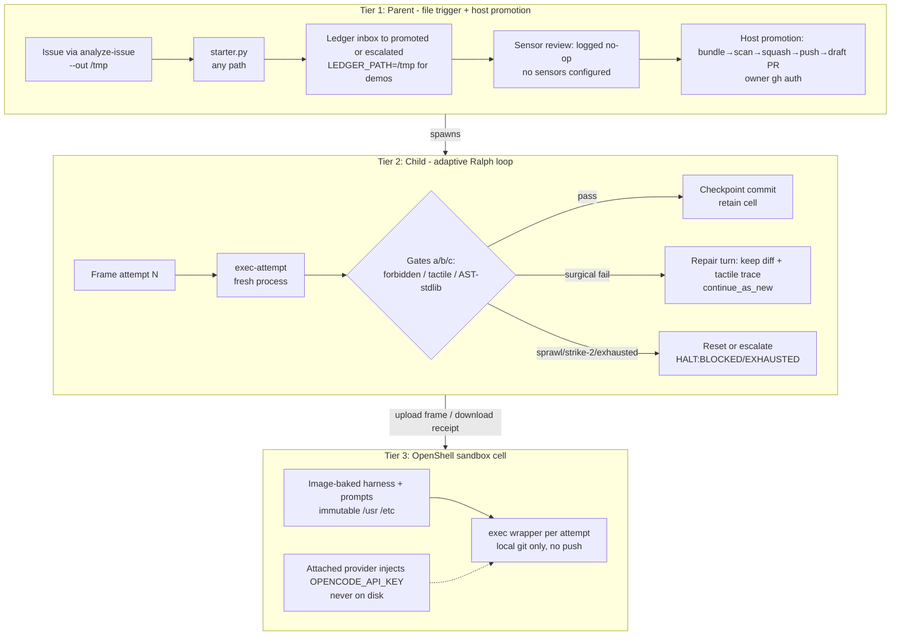

# agentic-sdlc — Enterprise Durable Ralph Loop

An industrial-grade autonomous coding loop based on the "Ralph Wiggum Loop":
**zero context rot via ephemeral process lifecycles and filesystem-driven
state persistence**, replacing brittle shell scripts with a durable
distributed fabric (Temporal orchestration + governed worker cells +
deterministic release at the PR boundary).

Workers start fresh on every attempt. Context comes strictly from an
ephemeral projected task frame plus local disk diffs — never from
accumulated conversation history. Static analysis moves upstream as sensory
organs driving remediation loops instead of downstream gates needing human
intervention.

Inference is the cheap part — retrying costs little next to shipping the
wrong result. The engineering is making sure the loop can't close until the
result satisfies the specification, not the agent's own say-so.

> **Status: proof of concept — live end-to-end rehearsal complete.** The full
> loop (inbox file → cell → gates → ledger → draft PR) is wired and has
> produced a real promotion: `TASK-403 promoted — https://github.com/johwes/tic-tac-toe/pull/1`
> (see [PoC status](#poc-status-whats-wired-vs-stubbed) and `tasks/ledger.md`).
> Start with `specs/README.md` (spec index) and `specs/intent.md` (frozen
> provenance); if code conflicts with specs, the specs win.
> New to agentic SDLC as a discipline? Start with the
> [Blueprint in 30 seconds](https://github.com/johwes/agentic-sdlc/blob/main/docs/blueprint/SUMMARY.md) — fifteen rules,
> one line each, each linking to the full treatment.

## Architecture

What actually runs is the PoC below. Enterprise target lives in `specs/02-control-plane.md` through `specs/06-release.md` (source: `specs/intent.md` §3); vendor-neutral best practice lives in `docs/blueprint/`.

PoC reality (what actually runs — laptop-local, `/tmp` demo flow):



Target → PoC map: webhook → file trigger + issue adapter (`02`);
decomposition → 1 file = 1 task (`02`); SonarQube/Snyk/DAST → logged
no-op (`05`); review panel → post-PoC slot (`02`); release trigger →
merging the PR *is* the release (`06`); worker pod/OpenShift →
OpenShift-free OpenShell sandbox, laptop-local worker (`04`); Tree-sitter
+ hold-outs → stdlib `ast`/`json` syntax only (`03`); always-reset →
`adaptive` (surgical continue first, `03`/`07`); egress proxy →
attached-provider injection (`04`).

- **Tier 1 — Macro Control Plane** (`temporal/parent.py`, `temporal/starter.py`):
  task lifecycles, ledger states (`inbox → active → review → promoted | escalated`),
  sensor review gate, draft-PR promotion. See `specs/02-control-plane.md`.
- **Tier 2 — Inner-Loop State Engine** (`temporal/child.py`): adaptive Ralph
  cycles — gates (a) `forbidden_paths`, (b) tactile command, (c) AST syntax —
  with surgical repair first, strike-2/sprawl reset, `continue_as_new` on
  retryable failure. See `specs/03-inner-loop.md`.
- **Tier 3 — Governed Worker Cell** (`harness/wrapper.py`, `scripts/spawn-cell.sh`,
  `docker/`, `policy/`): ephemeral OpenShell sandbox per task, one headless
  agent run per attempt, attached-provider credential injection (no secrets on disk).
  See `specs/04-worker-cell.md`.
- **Sensors** (`temporal/sensors.py`): upstream findings normalized to
  SARIF/JSON with a block/advise severity split and diff-scope rule.
  See `specs/05-sensors.md`.
- **Release** (`specs/06-release.md`): deterministic pipeline strictly
  downstream of the PR boundary; in the PoC, merging the promotion PR
  *is* the release.
- **Contracts** (`specs/07-contracts.md`): `current_task.json` (in),
  `task_receipt.json` + diff (out), `PROGRESS.md` projection rules.

## Repo map

| Path | What it is |
|------|-----------|
| `harness/wrapper.py` | In-cell harness: frame load, agent dispatch, `forbidden_paths` assertion, tactile check, receipt serialization |
| `temporal/` | Parent + child workflows, sensor suite, laptop-local worker/starter/dev-server (`requirements.txt` = `temporalio`) |
| `scripts/spawn-cell.sh` | Cell lifecycle: `create` / `exec-attempt` / `destroy` via the `openshell` CLI |
| `tasks/inbox/` | File-trigger seeds (`TASK-402/403.json` frozen); live triage writes `--out /tmp/...`, starter opens any path |
| `tasks/ledger.md` | Temporal-rendered projection, seed rows only (never hand-edit; demos project via `LEDGER_PATH=/tmp/...`) |
| `policy/`, `config/` | Sandbox network/provider policy, OpenCode sandbox config |
| `prompts/` | Canonical worker prompt contract (baked into the cell image) |
| `docker/` | Sandbox base image port + worker-cell layer |
| `specs/` | Normative per-topic specs (`README.md` is the index) |
| `AGENTS.md` | Agent working agreement (Ralph loop, invariants, git workflow) |
| `PROGRESS.md` | Ralph backlog checklist |

## PoC status: what's wired vs. stubbed

Rehearsal `2026-09-21` — `TASK-403` (`https://github.com/johwes/tic-tac-toe.git`,
`feat/TASK-403-tictactoe-antidiagonal`, `node --test tictactoe.test.js`) went
`inbox → active → review → promoted` in one attempt: child `SUCCESS/COMPLETE`
(SHA `c087968c2bdaed978433a39d0e0675dc0f5da497`, `tictactoe.js` anti-diagonal fix),
sensor review logged `review: skipped, no sensors configured`, ledger projected
live to `tasks/ledger.md`, promotion pushed the branch and opened draft PR #1
(`https://github.com/johwes/tic-tac-toe/pull/1`). Cell image pinned
`quay.io/jwesterl/worker-cell:2026-09-18-f33cc67` (baked `cell-harness`,
`worker_contract.txt`, `opencode.json`).

Wired and exercised (offline + live):

- Wrapper stages 1–4 (frame validation, `forbidden_paths` → `BLOCKED`,
  tactile timeout/truncation with nonzero → `FAILED`, SHAs + receipt
  serialization with nullable `token_metrics`, LLM dispatch + git identity,
  repo-dir resolution, fail-closed checkout, `files_changed` union).
- Parent workflow (file trigger, ledger projection via `project_ledger`,
  sensor no-op review, 2h SLA constants) and child workflow (attempt loop,
  gates a/b/c, `continue_as_new`, `reset` default, linear backoff) — both
  exercised through Temporal (see `temporal/worker.py`).
- Cell lifecycle (`scripts/spawn-cell.sh`: `create` tarball seeding,
  `exec-attempt` upload-to-dir + `mv`, receipt-first download, `destroy`;
  verified live including same-name `current_task.json` handling).
- Promotion `open_draft_pr` (bundle-download → host fetch → secret scan →
  squash → push → draft PR, `GIT_TERMINAL_PROMPT=0` fail-fast, host `gh`
  credential helper via `gh auth setup-git` — see `specs/02-control-plane.md`).
- Sensor suite stub: logged no-op with block/advise split, severity map,
  diff-scope, and curation budget ready for the first real sensor.
- Example frames `tasks/inbox/TASK-402.json` + `TASK-403.json` and live ledger.

Still stubs (expected):

- No live sensors beyond the no-op; no webhook adapter (file trigger only); no Tekton/ArgoCD.
- `tasks/ledger.md` row for `TASK-403` shows the first promotion; a retry
  demonstration of `continue_as_new` (e.g. a failing `TASK-404`) is future work.

## Getting started — offline demo (no infrastructure)

Prerequisites: `python3` (verified with 3.14.7) and `git`. No Temporal
server, no OpenShell access, no packages needed — the workflow modules
import SDK-free.

```bash
# 1. Everything compiles
python3 -m py_compile harness/wrapper.py temporal/parent.py temporal/child.py \
  temporal/sensors.py temporal/worker.py temporal/starter.py && echo COMPILE-OK
# COMPILE-OK

# 2. Load the example frame, run the PoC gates, inspect retry defaults
python3 -c "
import sys; sys.path.insert(0, 'temporal'); sys.path.insert(0, 'harness')
import parent, child, wrapper
frame, err = parent.load_frame('tasks/inbox/TASK-402.json')
assert err is None
print('frame:', frame['task_id'], '| attempt', str(frame['attempt'])+'/'+str(frame['max_attempts']), '|', frame['tactile_command'])
print('review (PoC no-op):', parent.review_gate('SUCCESS'))
print('backoff attempt 1/3 ->', child.backoff_delay_seconds(1), '/', child.backoff_delay_seconds(3), 'seconds; retry default:', child.coerce_retry_strategy({}))
print('wrapper frame fields:', len(wrapper.REQUIRED_FIELDS), 'required')
"
# frame: TASK-402 | attempt 1/5 | pytest tests/unit/test_search.py
# review (PoC no-op): ('promoted', 'review: skipped, no sensors configured')
# backoff attempt 1/3 -> 60 / 180 seconds; retry default: adaptive
# wrapper frame fields: 10 required

# 3. Validate the starter path without a server
python3 temporal/starter.py --dry-run tasks/inbox/TASK-402.json
# dry-run: would open ParentWorkflow (workflow_id=parent-TASK-402, task_queue='agentic-sdlc-dev') from tasks/inbox/TASK-402.json (attempt 1/5, branch feat/TASK-402-sanitize-search)
```

What you just saw: the frame loads against the 10-field contract, the
sensor review degrades to its logged no-op (never a silent skip), retry
policy resolves to its defaults, and the starter maps the inbox file to a
parent workflow open — all without a Temporal server.

## Getting started — infra path (requires access)

Prerequisites: the `temporal` CLI, `pip install -r temporal/requirements.txt`,
the `openshell` CLI with `gateway login` (Connected), an `opencode-go`
provider, and host `gh` auth wired to git (`gh auth login` + `gh auth setup-git`
— see `specs/02-control-plane.md` promotion). Without `setup-git`, the
`git push` step hangs on `Username for 'https://github.com':` until the
`GIT_TERMINAL_PROMPT=0` fast-fail (observed live; now fails in seconds, not 300s).

Demo flow — GitHub issue → /tmp → Temporal (leaves `git status` clean):

```bash
export LEDGER_PATH=/tmp/opencode/demo-ledger.md

# 1. Fetch the issue, triage to a frame in /tmp (no repo writes)
python3 scripts/analyze-issue.py --repo https://github.com/johwes/tic-tac-toe.git --issue-id 3 --out /tmp/opencode/demo-TASK-3.json
python3 temporal/starter.py --dry-run /tmp/opencode/demo-TASK-3.json
# dry-run: would open ParentWorkflow (workflow_id=parent-TASK-3, task_queue='agentic-sdlc-dev') from /tmp/opencode/demo-TASK-3.json (attempt 1/5, branch feat/task-3-anti-diagonal-win-broken)

# Terminal 1: laptop-local Temporal dev server (localhost:7233, UI :8233)
./temporal/dev-server.sh

# Terminal 2: worker polling the dev queue (parent + child workflows, all activities)
pip install -r temporal/requirements.txt
LEDGER_PATH=/tmp/opencode/demo-ledger.md python3 temporal/worker.py

# Terminal 3: open the parent workflow from the /tmp frame
python3 temporal/starter.py /tmp/opencode/demo-TASK-3.json
# → parent-TASK-3-* opens, child goes active → review (logged no-op) → promoted
# → branch feat/task-3-anti-diagonal-win-broken pushed, draft PR opened
# → /tmp/opencode/demo-ledger.md gains the promoted row; git status stays clean
```

Prior rehearsals (`TASK-403/pull/1`, `TASK-1/pull/4`, `TASK-3/pull/5`)
followed this same path; their ledger rows live on the tic-tac-toe PRs,
not in the checked-in `tasks/ledger.md` (seed rows only).

# Cell lifecycle directly (no Temporal needed):
TASK_ID=TASK-403 WORKSPACE_DIR=/tmp/wk403 ./scripts/spawn-cell.sh create
CELL=<name-from-create> FRAME_JSON=tasks/inbox/TASK-403.json ATTEMPT=1 ./scripts/spawn-cell.sh exec-attempt
CELL=<name> ./scripts/spawn-cell.sh destroy
```

Details live with the code: `temporal/dev-server.sh`, `temporal/worker.py`,
`temporal/starter.py` (`--dry-run`, `--webhook` rejected with the
file-trigger-only signal), and `scripts/spawn-cell.sh` (`create` /
`exec-attempt` / `destroy`, see `specs/04-worker-cell.md` spawn contract).

## Core contracts (one-paragraph version)

Temporal compiles a `current_task.json` frame per attempt (task id,
acceptance criteria, allowed/forbidden paths, curated `sensor_context`,
tactile command, budgets); the ephemeral worker returns a
`task_receipt.json` (`SUCCESS`/`FAILED`/`BLOCKED` + `exit_promise` + SHA +
files changed + tactile evidence) plus the diff — nothing else leaves the
cell. Nonzero tactile exit is absolute ground truth (`FAILED`); touching a
`forbidden_path` halts immediately (`BLOCKED`, never retried); tests are
never edited to pass. `PROGRESS.md` and `tasks/ledger.md` are
Temporal-projected in production — the checked-in `PROGRESS.md` backlog is
the PoC exception, toggled one topmost item per run. Full schemas:
`specs/07-contracts.md`.

## Further reading

- `specs/README.md` — spec index (load only what you need)
- `specs/intent.md` — frozen provenance; specs win on conflict
- `AGENTS.md` — agent working agreement (start here if you are an agent)
- `PROGRESS.md` — what the Ralph loop has finished
