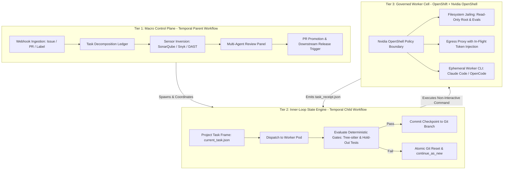

# agentic-sdlc — Enterprise Durable Ralph Loop

An industrial-grade autonomous coding loop based on the "Ralph Wiggum Loop":
**zero context rot via ephemeral process lifecycles and filesystem-driven
state persistence**, replacing brittle shell scripts with a durable
distributed fabric (Temporal orchestration + governed worker cells +
deterministic release at the PR boundary).

Workers start fresh on every attempt. Context comes strictly from an
ephemeral projected task frame plus local disk diffs — never from
accumulated conversation history. Static analysis moves upstream as sensory
organs driving remediation loops instead of downstream gates needing human
intervention.

> **Status: proof of concept.** The orchestration scaffolding, deterministic
> gates, and contracts are wired; live execution activities and the
> promotion step are still stubs (see [PoC status](#poc-status-whats-wired-vs-stubbed)).
> Start with `specs/README.md` (spec index) and `specs/intent.md` (frozen
> provenance); if code conflicts with specs, the specs win.

## Architecture



- **Tier 1 — Macro Control Plane** (`temporal/parent.py`, `temporal/starter.py`):
  task lifecycles, ledger states (`inbox → active → review → promoted | escalated`),
  sensor review gate, draft-PR promotion. See `specs/02-control-plane.md`.
- **Tier 2 — Inner-Loop State Engine** (`temporal/child.py`): atomic Ralph
  cycles — gates (a) `forbidden_paths`, (b) tactile command, (c) AST syntax —
  with atomic reset + `continue_as_new` on retryable failure. See
  `specs/03-inner-loop.md`.
- **Tier 3 — Governed Worker Cell** (`harness/wrapper.py`, `scripts/spawn-cell.sh`,
  `docker/`, `policy/`): ephemeral OpenShell sandbox per task, one headless
  agent run per attempt, egress token injection (no secrets on disk).
  See `specs/04-worker-cell.md`.
- **Sensors** (`temporal/sensors.py`): upstream findings normalized to
  SARIF/JSON with a block/advise severity split and diff-scope rule.
  See `specs/05-sensors.md`.
- **Release** (`specs/06-release.md`): deterministic pipeline strictly
  downstream of the PR boundary; in the PoC, merging the promotion PR
  *is* the release.
- **Contracts** (`specs/07-contracts.md`): `current_task.json` (in),
  `task_receipt.json` + diff (out), `PROGRESS.md` projection rules.

## Repo map

| Path | What it is |
|------|-----------|
| `harness/wrapper.py` | In-cell harness: frame load, agent dispatch, `forbidden_paths` assertion, tactile check, receipt serialization |
| `temporal/` | Parent + child workflows, sensor suite, laptop-local worker/starter/dev-server (`requirements.txt` = `temporalio`) |
| `scripts/spawn-cell.sh` | Cell lifecycle: `create` / `exec-attempt` / `destroy` via the `openshell` CLI |
| `tasks/inbox/` | PoC file trigger — drop hand-written `TASK-<n>.json` frames here |
| `tasks/ledger.md` | Temporal-rendered projection (never hand-edit) |
| `policy/`, `config/` | Sandbox network/provider policy, OpenCode sandbox config |
| `prompts/` | Canonical worker prompt contract (baked into the cell image) |
| `docker/` | Sandbox base image port + worker-cell layer |
| `specs/` | Normative per-topic specs (`README.md` is the index) |
| `AGENTS.md` | Agent working agreement (Ralph loop, invariants, git workflow) |
| `PROGRESS.md` | Ralph backlog checklist |

## PoC status: what's wired vs. stubbed

Wired and exercised without any infrastructure:

- Wrapper stages 1–3 (frame validation, `forbidden_paths` → `BLOCKED`,
  tactile timeout/truncation with nonzero → `FAILED`, SHAs + receipt
  serialization with nullable `token_metrics`).
- Parent workflow stub (file trigger, ledger rows, sensor no-op review,
  2h SLA constants) and child workflow (attempt loop, gates a/b/c,
  `continue_as_new`, `reset` default, linear backoff).
- Sensor suite stub: logged no-op with block/advise split, severity map,
  diff-scope, and curation budget ready for the first real sensor.
- Example frame `tasks/inbox/TASK-402.json` + ledger projection stub.

Still stubs (raise `NotImplementedError`, not runnable live):

- `run_attempt` / `reset_cell` / `checkpoint_commit` (shell-out to the
  `openshell` CLI) and the `open_draft_pr` promotion activity.
- No live sensors; no webhook adapter (file trigger only); no Tekton/ArgoCD.

## Getting started — offline demo (no infrastructure)

Prerequisites: `python3` (verified with 3.14.7) and `git`. No Temporal
server, no OpenShell access, no packages needed — the workflow modules
import SDK-free.

```bash
# 1. Everything compiles
python3 -m py_compile harness/wrapper.py temporal/parent.py temporal/child.py \
  temporal/sensors.py temporal/worker.py temporal/starter.py && echo COMPILE-OK
# COMPILE-OK

# 2. Load the example frame, run the PoC gates, inspect retry defaults
python3 -c "
import sys; sys.path.insert(0, 'temporal'); sys.path.insert(0, 'harness')
import parent, child, wrapper
frame, err = parent.load_frame('tasks/inbox/TASK-402.json')
assert err is None
print('frame:', frame['task_id'], '| attempt', str(frame['attempt'])+'/'+str(frame['max_attempts']), '|', frame['tactile_command'])
print('review (PoC no-op):', parent.review_gate('SUCCESS'))
print('backoff attempt 1/3 ->', child.backoff_delay_seconds(1), '/', child.backoff_delay_seconds(3), 'seconds; retry default:', child.coerce_retry_strategy({}))
print('wrapper frame fields:', len(wrapper.REQUIRED_FIELDS), 'required')
"
# frame: TASK-402 | attempt 1/5 | pytest tests/unit/test_search.py
# review (PoC no-op): ('promoted', 'review: skipped, no sensors configured')
# backoff attempt 1/3 -> 60 / 180 seconds; retry default: reset
# wrapper frame fields: 10 required

# 3. Validate the starter path without a server
python3 temporal/starter.py --dry-run tasks/inbox/TASK-402.json
# dry-run: would open ParentWorkflow (workflow_id=parent-TASK-402, task_queue='agentic-sdlc-dev') from tasks/inbox/TASK-402.json (attempt 1/5, branch feat/TASK-402-sanitize-search)
```

What you just saw: the frame loads against the 10-field contract, the
sensor review degrades to its logged no-op (never a silent skip), retry
policy resolves to its defaults, and the starter maps the inbox file to a
parent workflow open — all without a Temporal server.

## Getting started — infra path (requires access)

Prerequisites: the `temporal` CLI, `pip install -r temporal/requirements.txt`,
the `openshell` CLI with `gateway login` (Connected) and an `opencode-go`
provider. Honest caveat: **a live run currently stops at attempt
execution** — `run_attempt` is not yet implemented (see PoC status above).
This path is for bringing up the fabric and the cell lifecycle, not for a
full green run.

```bash
# Terminal 1: laptop-local Temporal dev server (localhost:7233, UI :8233)
./temporal/dev-server.sh

# Terminal 2: worker polling the dev queue (parent + child workflows, all activities)
pip install -r temporal/requirements.txt
python3 temporal/worker.py

# Terminal 3: open a parent workflow from the example frame
python3 temporal/starter.py tasks/inbox/TASK-402.json

# Cell lifecycle directly (no Temporal needed):
TASK_ID=TASK-402 WORKSPACE_DIR=/tmp/wk402 ./scripts/spawn-cell.sh create
CELL=<name-from-create> FRAME_JSON=tasks/inbox/TASK-402.json ATTEMPT=1 ./scripts/spawn-cell.sh exec-attempt
CELL=<name> ./scripts/spawn-cell.sh destroy
```

Details live with the code: `temporal/dev-server.sh`, `temporal/worker.py`,
`temporal/starter.py` (`--dry-run`, `--webhook` rejected with the
file-trigger-only signal), and `scripts/spawn-cell.sh` (`create` /
`exec-attempt` / `destroy`, see `specs/04-worker-cell.md` spawn contract).

## Core contracts (one-paragraph version)

Temporal compiles a `current_task.json` frame per attempt (task id,
acceptance criteria, allowed/forbidden paths, curated `sensor_context`,
tactile command, budgets); the ephemeral worker returns a
`task_receipt.json` (`SUCCESS`/`FAILED`/`BLOCKED` + `exit_promise` + SHA +
files changed + tactile evidence) plus the diff — nothing else leaves the
cell. Nonzero tactile exit is absolute ground truth (`FAILED`); touching a
`forbidden_path` halts immediately (`BLOCKED`, never retried); tests are
never edited to pass. `PROGRESS.md` and `tasks/ledger.md` are
Temporal-projected in production — the checked-in `PROGRESS.md` backlog is
the PoC exception, toggled one topmost item per run. Full schemas:
`specs/07-contracts.md`.

## Further reading

- `specs/README.md` — spec index (load only what you need)
- `specs/intent.md` — frozen provenance; specs win on conflict
- `AGENTS.md` — agent working agreement (start here if you are an agent)
- `PROGRESS.md` — what the Ralph loop has finished
