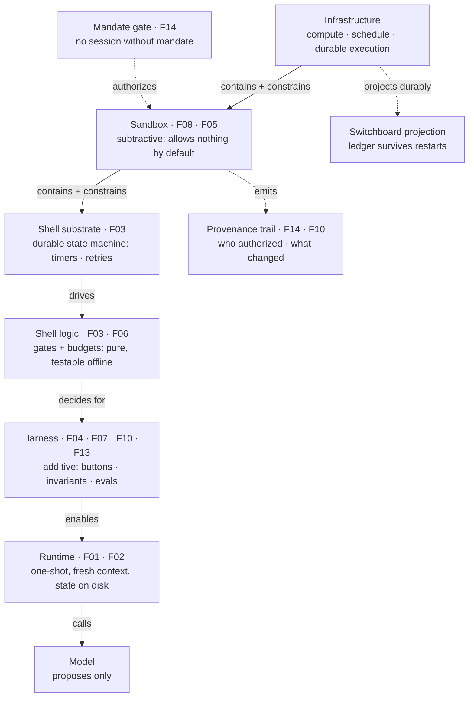
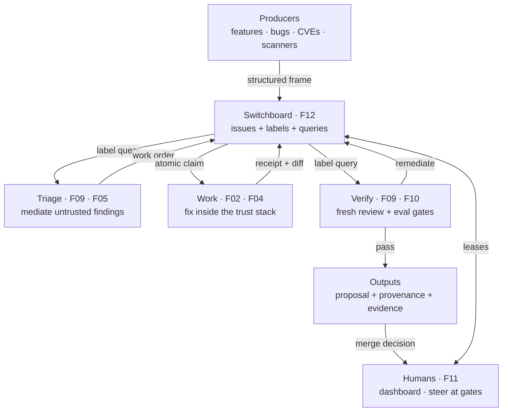
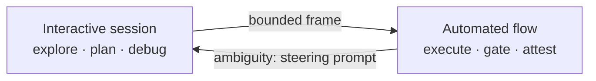

# 17 — Blueprint architecture (vendor-neutral)

Source: factors `01`–`15` in this folder + [Red Hat — What even is the harness in AI?](https://www.redhat.com/en/blog/what-even-harness-ai) (Bean, 2026-05-21).
No vendor names. No repo paths. PoC bindings kept out of the normative diagrams (one labeled non-normative footnote at the end of §1).
Maintenance: re-check this diagram against §4 whenever a factor's principle or scope changes — this is a snapshot synthesis and goes stale silently otherwise.

## 1. Matryoshka (trust stack, outside-in)

Read top-down as a trust stack: each layer contains and constrains the one
below it (subtractive outward, additive inward). Inner cannot bypass outer.
Follows Bean: Infrastructure → Sandbox → Harness → Runtime → Model,
with the blueprint's deterministic shell made explicit (F03) and coordination kept out
of the stack (see §2 — switchboard is a plane, not a layer).
Shell is split: durable substrate (survives crashes, owns timers/retries)
vs pure gate logic (testable offline). The ledger behind the switchboard
is a durable projection of Infrastructure, not a stack layer.

Reading: a finding that the agent "fixed" something means nothing until SHELL
logic re-ran the check on the durable substrate and SB attests what was actually
touched. Substrate without logic retries blindly; logic without substrate forgets
across crashes. HARN makes the agent *competent*; SB makes it *safe*. Different
owners, different failure modes —
a sandbox failure (did what it shouldn't) is not a harness failure (did poorly
what it should).

Agent-session lineage only — not SLSA/build provenance (see [16 — What's missing](16-whats-missing-factor.md), gap 7).
Replay needs the effective rendered inputs (templates + variables + tool schemas +
anchors as served), not just source-file commits.

Non-normative PoC binding (for readers coming from this repo, not part of the
vendor-neutral diagram): inner-loop workflow = Shell logic + substrate;
parent workflow = durable projection behind BOARD (§2); dev server = Infra.

## 2. Swimlanes (coordination flow, flat)

Flow = how work moves. No layer knows the layer beside it; all coupling goes
through the switchboard (F12). Flat here because job-shop routing is not nesting.

TRIAGE, WORK, and VERIFY are each their own instance of the §1 trust stack — they differ in capability profile within Sandbox (e.g. read-only triage/verify vs Bash+git fix, per Factor 08's scorer-vs-implementer example), not in trust structure.

Notes:

* Producers never call workstations directly (F12). A scanner, a human, and a
  release failure all file the same shape and leave.
* Triage vs fix is a trust split, not a pipeline stage: untrusted external
  findings go through mediation (F05); trusted first-party checks (local
  lint/type/test the author would run pre-PR) inject directly.
* Verification is a *different context* from production (F09). Regression
  blocks and attempt budgets live in code outside both (F06).
* Humans never sit in the step (F11). Constant approvals per feature,
  regardless of attempts underneath; escalations arrive as objective +
  attempts-made + blocking decision + diff preview, never raw transcripts.
* Scope: this diagram shows one team's switchboard; cross-team / cross-repo
  coordination across different teams' switchboards is an open gap (Factor 16, gap 5).
* Freshness: claims and commits are conditional on state freshness (generation/lease
  token). A steering intervention or re-label mid-run invalidates the token; stale
  writes abort and the ephemeral workspace is discarded — a stale worker never
  overwrites the winner. The discarded workspace is the disposable compute
  environment (F08), not the persisted state — the next attempt reads the patched
  frame and prior receipts fresh from disk (F01/F02), which is how history stays
  intact despite the discard.

## 3. Interactive / automated tiers (F15, dotted)

* Interactive: humans explore, accumulate context, debug against warm state.
  May not execute side effects except by filing a bounded frame.
* Automated: fresh contexts, declared effects, no human in the step.
  May not open interactive sessions on its own authority.
* Handoff is files (F01), re-verified on receipt, resumable mid-attempt
  (pause → patch frame → resume with history intact).
* Mandate steering is append-only: the base mandate stays immutable; interventions
  append signed, timestamped deltas. Effective intent is resolved deterministically
  (base + deltas in order), preserving the baseline audit trail (F14).

## 4. Factor → box map

| Factor | Box | Owns |
|---|---|---|
| 01 state on disk | Runtime (§1) + handoff (§3) | Files are truth; context is cache; static-first prompt order |
| 02 fresh contexts | Runtime (§1), Work (§2) | Same skill file, zero inherited conversation; capped diagnostic receipt only |
| 03 deterministic shell | Shell (§1) | Agent proposes, code decides; owns loop, waiting, verdicts |
| 04 buttons not parts | Harness (§1) | Atomic helpers with contracts; declared effects + cardinality caps |
| 05 don't leak internals | Sandbox (§1), Triage (§2) | Structured verdicts in; tolerant parsing out; assertion-only traces |
| 06 guardrails outside | Shell (§1) | Revision caps, regression block, separate infra vs revision budgets |
| 07 invariants + calibration | Harness (§1) | Must-stay-true list + good/bad anchors; third `indeterminate` where honest |
| 08 least-privilege sandbox | Sandbox (§1) | Capability restriction × reach restriction; placeholder credentials only |
| 09 adversarial review | Triage + Verify (§2) | Fresh-context verifier; deterministic score comparison; no self-review |
| 10 evals + save everything | Harness + Verify (§1/§2) | Held-out evals gate changes; trajectories/thinking/tool calls/costs saved + governed |
| 11 human on the loop | Humans (§2) | Dashboard, constant approvals, leases, in-flight steering, briefing format |
| 12 switchboard | Board (§2) | Labels + queries route; job-shop; modular adoption; atomic claims |
| 13 everything versioned | Harness + Shell (§1) | Prompts/skills/policies/evals as code: diffed, approved, rollback-capable; gate thresholds/caps versioned alongside prompts; provenance records effective inputs as served |
| 14 mandate + provenance | Gate + trail (§1) | Authorization before action; lineage on every artifact; replay without live services |
| 15 interactive tiers | §3 | Explore vs execute split; explicit handoff; escalate-don't-guess |

Factor 16's gaps are unscored and sit outside this map by design.

## 5. Resolved deltas + one proposal

1. Pre-PR gate set — resolved: synchronous in-stack gates (syntax, local unit-test
   subset, secret scan, `forbidden_paths` tripwire); asynchronous out-of-stack
   producers (integration matrices, SAST/DAST, multi-arch builds).
2. Direct inject vs review-agent mediation — resolved: worker's own execution
   outputs inject as capped diagnostic receipts (F02); all external findings pass
   through triage to a bounded work frame (F05).
3. New frame vs appended context — resolved: mid-run telemetry appends one capped
   entry without changing identity; scope shifts (acceptance or target files)
   terminate the attempt, invalidate the freshness token, and post a new frame
   requiring mandate re-authorization. This covers untrusted external findings
   implying scope change; trusted human steering during an authorized pause
   follows §3 (patch + resume), not re-framing.
4. Eval archive governance — proposal (retention TBD per compliance, not locked):
   tiered lifecycle of hot debug stream / redacted golden trajectories / immutable
   metadata index. Shape accepted; windows, redaction rules, and budgets open.
