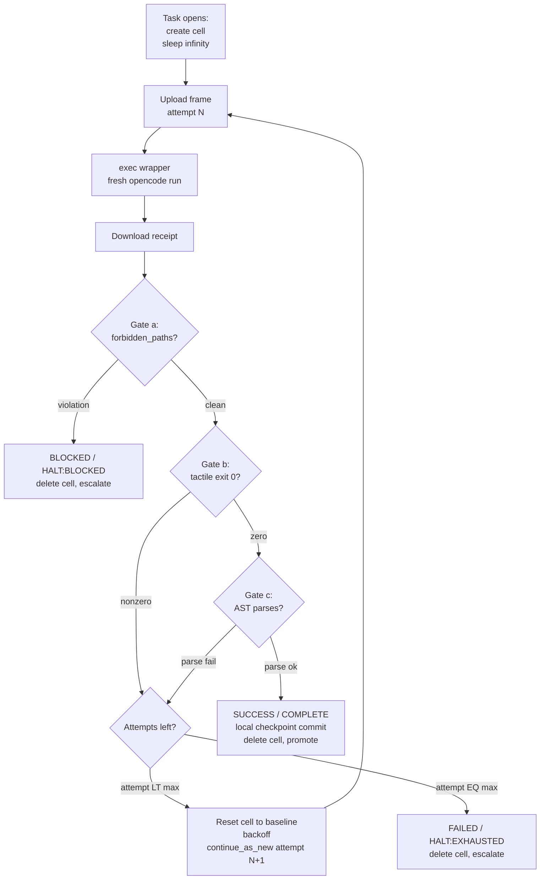

# 03 — Inner-Loop State Engine (Temporal Child Workflow)

Source: `intent.md` §§1–3 (T2). Fleshed out via spec interview (round 5).
Defaults applied where noted (locked by owner: "use your defaults").

## Goal

Execute atomic Ralph cycles with zero context carryover between attempts.

## Non-goals

- Cross-task orchestration (parent concern, see `02-control-plane.md`).
- Worker sandboxing mechanics (worker concern, see `04-worker-cell.md`).
- Release packaging (see `06-release.md`).

## Inputs

- Projected task frame: `current_task.json` (compiled by Temporal; schema in
  `07-contracts.md`).

## Outputs

- On gate pass: local checkpoint commit (see checkpoint model below).
- On retryable fail: atomic `git reset` + `continue_as_new()` (fresh history,
  no rot).
- On halt: escalation to the parent (or human) with the final receipt.
- Worker result artifact per attempt: `task_receipt.json` (schema in
  `07-contracts.md`).

## Attempt lifecycle (per-task cell, exec-per-attempt)

One sandbox per task (keepalive `sleep infinity`); each attempt is a fresh
headless process via `sandbox exec`. Freshness comes from process exit, not
sandbox churn — files + git persist in the cell across attempts, which is
the Ralph pattern (state in files, never in memory). See `04-worker-cell.md`
for the spawn/exec contract.

Cell failure mid-task (sandbox lost/unreachable): recreate the cell,
re-upload the repo at the last commit SHA from the ledger, resume at the
current attempt. The cell holds no irreplaceable state — receipts and SHAs
live in Temporal history.

## Gates (evaluated in order)

- **(a) `forbidden_paths` diff assertion.** Any touched forbidden path →
  `BLOCKED` / `HALT:BLOCKED`. Immediate halt, no retry (anti-fuzzing +
  frame/repo mismatch signal). See `07-contracts.md`.
- **(b) Tactile ground truth.** `tactile_execution.exit_code != 0` (including
  `124` on timeout) → `FAILED`. The agent cannot override test failure with
  justification; `agent_summary` is diagnostics for the next attempt only.
- **(c) Tree-sitter AST + hold-outs.** PoC: **syntax validity only** — every
  changed file must parse under its extension-mapped grammar. The hold-out
  stage is **reserved-but-inactive** in the PoC: the `tests/evals/**`
  read-only mount and its `forbidden_paths` tripwire stay enforced (agents
  habituate to the boundary; anti-gaming structure exists), but no hidden
  suite is required to run. Post-PoC activation = drop a suite behind the
  existing mount + flip the gate on. "Deferred" means unimplemented, not
  abandoned.

## Retry budget & backoff (defaults)

- `max_attempts` defaults to **5** when the frame omits it; an explicit
  per-task value always wins.
- **Linear backoff** between attempts: delay = `60s × attempt`, capped at
  5 min. (Constants are defaults; tune with evidence, not vibes.)
- Retry carries **zero context**: `continue_as_new()` with a fresh frame at
  `attempt + 1`. The previous attempt's `agent_summary` may ride along as
  text diagnostics — never as conversational memory.
- `retry_strategy` frame field (default `"reset"`): `"reset"` =
  `git reset --hard baseline_sha` inside the cell before the next attempt
  (clean slate; matches process-per-attempt freshness); `"continue"` = keep
  the failed attempt commit and build on top (explicit opt-in only). Failed
  commits remain in reflog/diagnostics either way.

## Checkpoint & promotion model: local commit + eventual squash

- **Per-attempt `SUCCESS`:** the worker's commit stays strictly inside the
  cell/host checkout. No network push from workers — no remote pollution,
  no force-push races, zero-cost rollback of bad candidates. The wrapper
  records the SHA in `task_receipt.json`; Temporal logs it in history.
  (Rationale: tactile pass ≠ hold-out/security pass. Candidate evaluation
  and state mutation are separate phases.)
- **Promotion (outer loop):** after all verification gates pass, Temporal
  squashes per-attempt commits into one clean commit
  (e.g. `fix(TASK-402): sanitize search input`) and pushes `target_branch`
  to origin, opening/updating the PR. Preserved-history push is the
  documented alternative when atomic attempt history aids debugging.

## Timeout & cleanup ownership

- Attempt wall-clock: `sandbox exec --timeout` (tactile budget + margin)
  bounds the whole attempt; `tactile_timeout_seconds` (default 180s) is
  enforced by the wrapper inside it; Temporal activity timeouts bound the
  outermost layer.
- The Temporal worker owns cell deletion: `openshell sandbox delete` when
  the task reaches a terminal state (`promoted` / `escalated`), in a
  `finally` block (or on activity timeout). No orphaned sandboxes. The cell
  is per-task, not per-attempt — attempts never create or delete it, only a
  lost cell triggers recreation (see lifecycle).

## Failure modes

- Worker mutates hold-out evals or test assertions to force green (must be
  structurally impossible: read-only mounts, see `04-worker-cell.md`).
- Partial commits leaking failed-attempt state (reset must be atomic).
- History growth across retries (must use `continue_as_new`, not unbounded
  history append).
- Workers pushing to origin directly (forbidden: workers have no push
  path; only the promotion step pushes).
- Unbounded loops on stochastic systems (budget + backoff + `HALT` states
  bound every task).

## Open questions

- Tree-sitter grammar set pinning (which grammars ship in the worker image?).
- Backoff constant tuning under real attempt-latency data.
- Confirm `retry_strategy` default stays `"reset"` after PoC evidence.
- Hold-out suite sourcing, rotation, and activation criteria (post-PoC).
