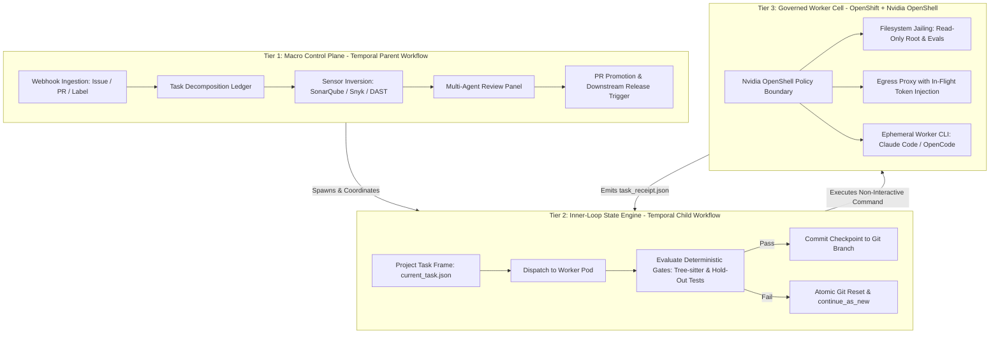

# Specs — Enterprise Durable Ralph Loop

High-level index for agents. Raw source: [`intent.md`](./intent.md) (frozen provenance).
Per-topic files below are the normative detail — load only what you need.

## What this is

Industrial-grade autonomous coding loop based on the "Ralph Wiggum Loop":
zero context rot via ephemeral process lifecycles and filesystem-driven state
persistence, replacing brittle shell scripts with a durable distributed fabric
(Temporal orchestration + governed worker cells + deterministic release at the PR boundary).

## Topology (copied verbatim from `intent.md` §3)

## Spec index

| Spec | Read this when… |
|------|-----------------|
| [`01-principles.md`](./01-principles.md) | You need the architectural invariants (context hygiene, Temporal as source of truth, CI inversion, zero-trust sandbox). |
| [`02-control-plane.md`](./02-control-plane.md) | You work on the Temporal Parent: ingestion, decomposition ledger, SLAs, review panel, PR promotion. |
| [`03-inner-loop.md`](./03-inner-loop.md) | You work on the Temporal Child: Ralph cycle, `continue_as_new`, gates, commit vs. atomic reset. |
| [`04-worker-cell.md`](./04-worker-cell.md) | You work on the OpenShift + OpenShell worker: jailing, egress proxy, ephemeral CLI invocation. |
| [`05-sensors.md`](./05-sensors.md) | You work on upstream static/security sensors (SonarQube, CodeQL, Snyk, Trivy, DAST) and their SARIF/JSON contracts. |
| [`06-release.md`](./06-release.md) | You work on the deterministic release pipeline (Tekton/ArgoCD) at/after the PR boundary. |
| [`07-contracts.md`](./07-contracts.md) | You need artifact schemas: `current_task.json`, `task_receipt.json`, `PROGRESS.md` projection rules. |

## Conventions

- `intent.md` is frozen raw source. If a per-topic spec conflicts with it, flag it — don't silently diverge.
- Per-topic files follow: Goal → Non-goals → Inputs/Outputs → Flow → Failure modes → Open questions.
- Gaps go under Open questions, not invented detail.
